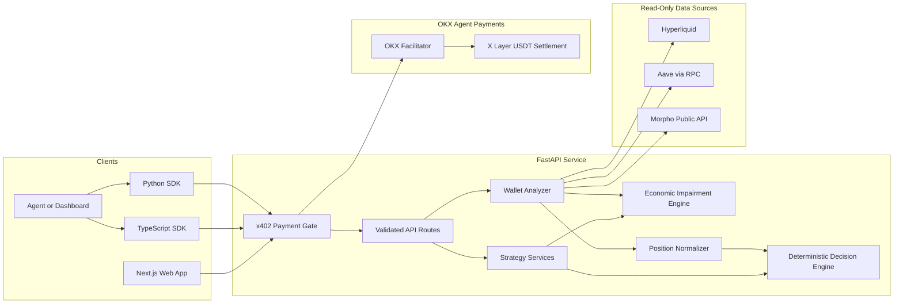

# Δ DeltaZero

## Deterministic risk intelligence for pseudo delta neutral DeFi strategies

Build strategies, analyze hedge drift, simulate economic impairment, and assess supported public wallet portfolios through one transparent risk engine.

<div align="center">

[](https://www.python.org/)
[](https://fastapi.tiangolo.com/)
[](https://nextjs.org/)
[](https://www.typescriptlang.org/)
[](https://tailwindcss.com/)
[](LICENSE)
[](https://www.okx.com/)

[Live Application](https://delta-zero-alpha.vercel.app) ·
[Judge Demo](https://delta-zero-alpha.vercel.app/demo) ·
[API Documentation](https://deltazero-production.up.railway.app/docs) ·
[SDK Preview](#sdk-preview) ·
[X](https://x.com/DeltaZeroASP)

</div>

DeltaZero is an open-source, production-oriented ASP for deterministic DeFi risk analysis. It converts strategy assumptions and supported public wallet data into structured metrics, strategy health, recommended actions, risk notes, and decision confidence without claiming to predict markets.

The public Judge Demo provides a no-payment walkthrough of verified reference scenarios across Strategy Build, Hedge-Drift Auditing, Monte Carlo, and Funding Stress Testing. It does not bypass or weaken x402 protection on real analysis endpoints.

## Methodology, provenance, and support

The live [Methodology](https://delta-zero-alpha.vercel.app/methodology) page documents DeltaZero's formulas, worked Safety Buffer calculation, threshold provenance, model card, impairment model, Monte Carlo assumptions, reproducibility requirements, validation status, data sources, and limitations. Completed Strategy Build, Funding Stress Testing, and Wallet Auditor reports include a visible provenance panel with the source, source snapshot, report time, and data-quality context when available. DeltaZero does not claim historical validation or empirical threshold calibration until a versioned, time-aligned replay dataset is published.

## Live MCP server

DeltaZero exposes a standards-compliant, stateless Streamable HTTP Model Context Protocol server at:

```text
https://deltazero-production.up.railway.app/mcp
```

MCP initialization, tool discovery, methodology resources, and `get_hyperliquid_market_context` are free. Premium deterministic tools preserve the existing 1 USDT **OKX Agent Payments Protocol** boundary and return a standard HTTP 402 challenge when invoked without payment:

- `build_neutral_strategy`
- `audit_hedge_drift`
- `run_funding_stress`
- `run_monte_carlo`
- `run_complete_risk_engine` — all four coordinated reports in one paid invocation

The MCP tools call the same Python service functions used by the REST API; formulas and recommendation logic are not duplicated. Tool inputs and structured outputs are generated from the same Pydantic contracts, so compatible agents do not need endpoint-specific response parsers.

Connect locally with MCP Inspector:

```bash
npx -y @modelcontextprotocol/inspector
```

Then use `http://127.0.0.1:8000/mcp` as the Streamable HTTP server URL.

For product questions, API issues, payment problems, or data-quality reports, use the [Support page](https://delta-zero-alpha.vercel.app/support). Support will never request a seed phrase, private key, wallet approval, admin bypass key, or API secret.

GitHub Actions runs backend tests, frontend lint and production build, and both SDK test suites for pushes to `main` and pull requests. No production credentials are required by CI.

## DeltaZero Risk Zones

DeltaZero classifies completed Strategy Build, Wallet Auditor, Funding Stress Testing, and Monte Carlo reports into five operator-friendly zones: **Optimal**, **Healthy**, **Watch**, **Defensive**, and **Critical**.

Risk zones are deterministic interpretations of existing report metrics. They are not trading instructions and do not predict profitability.

## Editor Demo Access

Editor Demo Access lets a trusted editor use the existing backend admin-key check during one browser session without changing normal x402 behavior:

1. Set `DELTAZERO_ADMIN_KEY` in the Railway backend variables.
2. Share a temporary demo key privately with the editor.
3. The editor opens `/demo-access`.
4. The editor enters the key.
5. The frontend sends `X-DeltaZero-Admin-Key` for protected API calls during that browser session.
6. Rotate the key after recording.

Never place the key in `NEXT_PUBLIC` variables or public code.

The current product includes Strategy Build, Hedge-Drift Auditing, Funding Stress Testing, read-only Wallet Auditor, and Agent Operator Console. It never requests private keys, seed phrases, trading signatures, approvals, or transaction permissions, and it does not execute trades. The backend includes an x402 payment boundary for per-call USDT authorization; payment credentials are separate from any trading or protocol permission.

## Why DeltaZero?

Pseudo delta-neutral strategies can look attractive while hiding hedge drift, weak collateral, negative carry, liquidation exposure, or severe scenario losses; DeltaZero makes those risks explicit before a user or agent acts.

DeltaZero is differentiated by:

- **Deterministic decisions** — recommendations come from documented rules and evaluated thresholds rather than opaque generated calculations.
- **One risk language** — Strategy Build, Hedge-Drift Auditing, Funding Stress Testing, and Wallet Auditor consistently report health, action, Safety Buffer, risk notes, and Decision Confidence.
- **Read-only portfolio analysis** — supported public protocol data is analyzed without custody or wallet permissions.
- **Agent-ready contracts** — FastAPI schemas and local TypeScript and Python SDK packages expose structured responses for dashboards and automated workflows.

## Feature Overview

| Capability | Status | Description |
| --- | --- | --- |
| Strategy Build | Live | Constructs a deterministic pseudo delta-neutral structure from capital, risk tolerance, target style, and market assumptions. |
| Hedge-Drift Auditing | Live | Evaluates an existing long, short, and collateral structure and recommends corrective action. |
| Funding Stress Testing | Live | Applies deterministic funding shocks and calculates post-stress risk and scenario-based economic impairment. |
| Wallet Auditor | Live · Pro Preview | Analyzes supported public wallet positions through read-only protocol adapters. |
| Agent Operator Console | Live · Simulation | Runs a session-only guard loop that detects simulated hedge drift, calls the live audit API, pauses at x402, and prepares an approval-gated proposal without claiming payment or trade execution. |
| Decision Engine | Live | Centralizes carry, hedge, Safety Buffer, capital-risk, health, action, and confidence evaluation. |
| Economic Impairment Engine | Live | Estimates impairment loss, post-impairment equity, and a non-overlapping loss breakdown. |
| x402 Payment Gate | Ready locally | Issues standards-compliant challenges and supports facilitator-verified per-call settlement when official credentials are configured. |
| Interactive Strategy Preview | Live | Provides a clearly labelled illustrative simulation on the landing page. |
| TypeScript SDK | SDK Preview | Supplies a typed local client for every current API service. |
| Python SDK | SDK Preview | Supplies a typed local client for every current API service. |
| Hyperliquid | Live | Reads supported perpetual positions and account context from public protocol data. |
| Aave | Live with RPC | Reads supported lending and collateral data when an RPC endpoint is configured. |
| Morpho | Live | Reads supported market and vault positions from Morpho's public API. |

## Products

### Agent Operator Console

The `/agent` console turns DeltaZero's structured API into a transparent operator workflow. A user selects risk tolerance and strategy mandate, spawns a session-only guard, and watches the guard compare simulated hedge drift against the configured intervention boundary. When the boundary is breached, the console calls live Hedge-Drift Auditing. It either displays the returned recommendation or pauses at the x402 payment boundary. Execution authority remains disabled until a separately authorized and compatible venue adapter is configured.

### Agent-in-a-Box example

The executable [`examples/agent-bot/agent-bot.mjs`](examples/agent-bot/agent-bot.mjs)
demonstrates an autonomous monitoring loop: simulated wallet scan, hedge-drift
trigger, live paid audit request, automatic x402 authorization through Onchain OS,
and a proposal-only rebalance payload. See the
[`example guide`](examples/agent-bot/README.md) for safeguards and run commands.

### Strategy Build

The Builder creates a proposed structure from:

- asset and deployable capital;
- risk tolerance;
- target style;
- long-yield assumption;
- short-funding assumption; and
- fee-drag assumption.

It returns recommended long notional, short notional, collateral allocation, target hedge ratio, carry metrics, Safety Buffer, strategy health, Decision Confidence, recommendation, and risk notes.

Supported target styles are:

- `neutral_yield`
- `conservative_income`
- `aggressive_carry`
- `capital_preservation`

Each style uses a distinct deterministic allocation and threshold profile.

### Hedge-Drift Auditing

Hedge-Drift Auditing evaluates a supplied long, short, and collateral structure. It measures hedge alignment, net delta, carry, collateral resilience, Safety Buffer, and capital at risk before returning an action such as `HOLD`, `REBALANCE`, `REDUCE`, or `CLOSE`.

### Funding Stress Testing

Funding Stress Testing evaluates stressed rather than original metrics. It supports deterministic scenario inputs for funding deterioration, yield reduction, price movement, collateral pressure, exit slippage, liquidation penalties, and protocol-loss assumptions.

Its report includes:

- scenario result;
- post-stress metrics;
- post-stress health;
- recommended action;
- Decision Confidence;
- risk notes;
- estimated impairment loss; and
- post-impairment equity.

### Monte Carlo Sensitivity Analysis

Monte Carlo analysis runs 100 to 10,000 bounded stress paths across market movement, funding shifts, exit slippage, collateral haircuts, collateral depeg, and protocol-loss assumptions. Its systemic mode uses a configurable correlated Student-t model: collateral depeg severity can simultaneously amplify funding pressure, slippage, and collateral impairment. It reports impairment and post-stress equity distributions, depeg and breach probabilities, percentile outcomes, observed correlation, and ranked sensitivity drivers. These correlations are transparent scenario assumptions, not empirically calibrated forecasts.

### Report history and notification handoff

Completed Risk Engine and Monte Carlo reports are saved in the user's browser at `/history` (up to 25 reports). Users can export JSON or share a computed risk snapshot through email and Telegram. This is local report history and notification handoff—not continuous background monitoring. Unattended alerts still require a future server-side scheduler, durable storage, and opt-in notification subscriptions.

The engine is deterministic when a seed is supplied and reuses DeltaZero's existing impairment, metric, and threshold logic. It is a sensitivity tool—not a price forecast—and it does not source, infer, or fabricate future market data. Builder results and supported Wallet Auditor exposures can be transferred through short-lived browser session storage for simulation.

Key inputs include the current structure, capital, carry assumptions, simulation count, time horizon, seed, and bounded volatility assumptions. Outputs include P50/P95/P99 impairment, expected post-stress equity, Safety Buffer and hedge-drift breach probabilities, negative-carry probability, sensitivity contributions, and up to 50 sample paths.

## Wallet Auditor

The Wallet Auditor discovers and normalizes positions available through supported read-only integrations. It aggregates exposure, collateral, debt, unrealized PnL where reliable, hedge alignment, liquidation context, Safety Buffer, capital at risk, and estimated impairment.

The wallet report explicitly distinguishes:

- `positions_found`
- `no_supported_positions`
- `partial_data`
- `insufficient_data`

No supported positions and incomplete data are terminal assessment states, not evidence of a healthy portfolio. Missing values remain nullable instead of being silently treated as zero risk.

Open the [Wallet Auditor](https://delta-zero-alpha.vercel.app/wallet) to analyze supported public data.

## Live Read-Only Integrations

### Hyperliquid — LIVE

Read-only perpetual positions, margin data, account value, unrealized PnL, and liquidation context through public protocol data.

### Aave — LIVE WITH RPC

Read-only supply, borrow, collateral, debt, and health-factor analysis when supported RPC access is configured.

Set `ETHEREUM_RPC_URL` and `ARBITRUM_RPC_URL` in the backend environment to enable the configured network access. RPC credentials must never be committed.

### Morpho — LIVE

Read-only market and vault position analysis through Morpho's supported public API.

Live integrations are read-only. DeltaZero does not request signatures, private keys, approvals, or transaction permissions. Unsupported positions and unavailable data sources are reported explicitly and are not treated as zero risk.

## Architecture



### Frontend

The web interface uses Next.js App Router, React, TypeScript, and Tailwind CSS. It connects to the backend through `NEXT_PUBLIC_API_BASE` and contains no authentication, wallet connection, transaction flow, database, or client-side calculation engine.

### Backend

FastAPI and Pydantic validate requests and responses. Service modules own strategy construction, position auditing, stress testing, wallet analysis, normalized metrics, recommendations, and impairment calculations.

### Decision Engine

The centralized engine evaluates carry, hedge drift, Safety Buffer, capital risk, and impairment state. Strategy health, action, summary, risk notes, and Decision Confidence originate from the same evaluated context.

Decision Confidence measures how clearly the current metrics support a recommendation. It is not a profitability forecast or a strategy-quality score.

### Economic Impairment

The impairment engine compares pre-stress and post-stress portfolio equity. Short-hedge gains offset long-leg losses where appropriate, while collateral haircuts, exit slippage, liquidation penalties, and protocol-loss assumptions are applied without blindly adding overlapping losses.

This is scenario-based economic impairment analysis, not formal IFRS or accounting impairment.

## How It Works

```text
Input assumptions or public wallet address
                  ↓
Validate and normalize the request
                  ↓
Calculate carry, hedge, collateral, and risk metrics
                  ↓
Evaluate deterministic thresholds and scenario impairment
                  ↓
Return health, action, confidence, notes, and structured JSON
```

The recommendation vocabulary depends on the service:

- Builder: `OPEN`, `REBALANCE`, or `WAIT`
- Auditor: `HOLD`, `REBALANCE`, `REDUCE`, or `CLOSE`
- Wallet Auditor: `HOLD`, `REBALANCE`, `REDUCE`, or `CLOSE` when an assessment is meaningful

## SDK Preview

DeltaZero includes thin, type-safe clients that call the existing deployed API. They do not duplicate backend calculations.

The packages are available directly from this repository for local installation and agent integration. They are not currently published to npm or PyPI.

### TypeScript

Package name: `@deltazero/core`

Repository path: [`sdk/typescript`](sdk/typescript)

```bash
cd sdk/typescript
npm install
npm run build
npm test
```

```ts
import { DeltaZeroClient } from "@deltazero/core";

const client = new DeltaZeroClient({
  baseUrl: "https://deltazero-production.up.railway.app",
  timeoutMs: 10_000,
});

const report = await client.buildStrategy({
  asset: "SOL",
  capital_usd: 5000,
  risk_tolerance: "medium",
  target_style: "neutral_yield",
  long_yield_apy: 14,
  short_funding_apy: 3,
  fee_drag_apy: 1,
});

console.log(report.recommendation.action);
```

Available methods:

- `buildStrategy()`
- `auditPosition()`
- `stressTest()`
- `auditWallet()`

### Python

Package name: `deltazero-core`

Repository path: [`sdk/python`](sdk/python)

```bash
cd sdk/python
python3 -m venv .venv
source .venv/bin/activate
pip install -e .
python3 -m unittest discover -s tests -p "test_*.py"
```

```python
from deltazero import DeltaZeroClient

client = DeltaZeroClient(
    base_url="https://deltazero-production.up.railway.app",
    timeout_s=10,
)

report = client.build_strategy({
    "asset": "SOL",
    "capital_usd": 5000,
    "risk_tolerance": "medium",
    "target_style": "neutral_yield",
    "long_yield_apy": 14,
    "short_funding_apy": 3,
    "fee_drag_apy": 1,
})

print(report["recommendation"]["action"])
```

Available methods:

- `build_strategy()`
- `audit_position()`
- `stress_test()`
- `audit_wallet()`

Agent and dashboard use cases include deterministic pre-trade checks, portfolio review workflows, scenario-risk gates, report generation, and structured inputs to broader orchestration systems. DeltaZero does not execute the resulting action.

## API Reference

### Live Hyperliquid market context

`GET /market/hyperliquid?asset=ETH&lookback_hours=24` returns normalized mark and oracle prices, signed current hourly funding and APY, open interest, 24-hour notional volume, premium when available, and a historical funding summary. The service uses Hyperliquid's public Info API only, with short-lived in-memory caching.

Positive funding means longs pay shorts; negative funding means shorts pay longs. DeltaZero preserves that sign. Funding rates are variable and may change after analysis.

### Manual and live Builder modes

The Builder defaults to manual assumptions. Live Hyperliquid mode retrieves public market context while keeping long-yield and fee-drag inputs manual. Because the existing Builder field represents a short-side funding cost, signed market funding is converted centrally: positive market funding becomes income to the short hedge, while negative market funding becomes a cost.

### Wallet hedge workflow

Successful Wallet Auditor reports can pass a normalized, non-sensitive exposure snapshot to the Builder through short-lived browser session storage. The Builder calculates a proposed short adjustment for long-dominant portfolios using the configured style and risk target, and the proposed structure can then be handed to Stress Test. These are read-only analytical recommendations: DeltaZero does not request signatures, submit transactions, or execute hedges.

### Base URLs

| Environment | URL |
| --- | --- |
| Local | `http://localhost:8000` |
| Production | `https://deltazero-production.up.railway.app` |
| Swagger UI | [Production API documentation](https://deltazero-production.up.railway.app/docs) |
| OpenAPI schema | `https://deltazero-production.up.railway.app/openapi.json` |

### Endpoints

| Method | Endpoint | Purpose |
| --- | --- | --- |
| `GET` | `/` | Check the public service root. Free. |
| `GET` | `/health` | Check backend availability. |
| `GET` | `/docs` | Open Swagger UI. Free. |
| `GET` | `/openapi.json` | Read the OpenAPI contract. Free. |
| `POST` | `/strategy/build` | Build and evaluate a proposed strategy. x402 payment required. |
| `POST` | `/strategy/audit` | Audit an existing position structure. |
| `POST` | `/stress-test/run` | Apply a deterministic stress scenario and impairment model. |
| `POST` | `/strategy/stress-test` | Protected legacy alias retained for SDK compatibility. |
| `POST` | `/wallet/analyze` | Analyze supported public wallet positions. x402 payment required. |
| `POST` | `/monte-carlo/run` | Run seeded Monte Carlo sensitivity analysis. x402 payment required. |
| `POST` | `/risk-engine/analyze` | Run Strategy Build, Hedge-Drift Auditing, Funding Stress Testing, and Monte Carlo Sensitivity as one coordinated paid analysis. |

### x402 payments and pricing

DeltaZero uses the official OKX x402 seller middleware. An unpaid request to a protected route returns `HTTP 402 Payment Required` with a base64-encoded `PAYMENT-REQUIRED` header. The header is the authoritative payment quote and identifies the network, stablecoin contract, atomic amount, receiver, and supported payment schemes.

The price is configured with `PAYMENT_PRICE_USDT`. The primary product flow calls `/risk-engine/analyze`: one 1 USDT payment returns all four coordinated Risk Engine reports for one submitted strategy. A new analysis is a new paid call. Agent Console, Hyperliquid Live, Judge Demo, health, documentation, and OpenAPI remain free. Portfolio Audit and legacy individual analysis endpoints remain separately protected for API compatibility.

With only the three `PAYMENT_*` variables, the server operates in challenge-only mode: it returns the quote but never releases a protected resource. Once all three official OKX facilitator credentials are configured, the submitted `PAYMENT-SIGNATURE` or legacy `X-PAYMENT` credential is verified and settled synchronously before the handler runs, and a successful response includes `PAYMENT-RESPONSE`.

### Browser payment

Human users can complete the same purchase directly in the web app with the OKX Wallet browser extension. DeltaZero uses the official `@okxweb3/x402-fetch` and `@okxweb3/x402-evm` clients to request account access, switch to X Layer, display the wallet's typed-data approval, and replay the original request with the resulting payment authorization. The backend verifies and settles it before releasing the four reports.

No private key or OKX API credential enters the frontend. The wallet shows the token, amount, network, and recipient before the user approves. Agentic clients can continue using the raw x402 challenge and paid replay directly.

Unpaid challenge:

```bash
curl --include \
  --request POST \
  --url https://deltazero-production.up.railway.app/strategy/build \
  --header 'Content-Type: application/json' \
  --data @builder-request.json
```

Paid replay after an x402-compatible wallet signs the returned challenge:

```bash
curl --include \
  --request POST \
  --url https://deltazero-production.up.railway.app/strategy/build \
  --header 'Content-Type: application/json' \
  --header "PAYMENT-SIGNATURE: ${PAYMENT_SIGNATURE}" \
  --data @builder-request.json
```

Never construct a payment credential by hand or treat the presence of a header as proof of payment. In challenge-only mode all paid replays fail closed. In settlement mode DeltaZero forwards credentials to the OKX facilitator for cryptographic verification and settlement before returning the protected resource.

### Admin Testing

The admin bypass is for owner and developer testing only. Set `DELTAZERO_ADMIN_KEY` in the backend environment, then send the value in the `X-DeltaZero-Admin-Key` request header from curl, Postman, or an agent. A correct key bypasses x402 for protected endpoints; a missing or incorrect key follows the normal payment flow.

Never commit this key, place it in a `NEXT_PUBLIC_*` variable, or expose it in browser code. DeltaZero logs only `admin_bypass_used=true` when the bypass is used and never logs or returns the key itself.

```bash
curl --request POST \
  --url https://deltazero-production.up.railway.app/strategy/build \
  --header 'Content-Type: application/json' \
  --header "X-DeltaZero-Admin-Key: ${DELTAZERO_ADMIN_KEY}" \
  --data @builder-request.json
```

### Builder request body

```json
{
    "asset": "SOL",
    "capital_usd": 5000,
    "risk_tolerance": "medium",
    "target_style": "neutral_yield",
    "long_yield_apy": 14,
    "short_funding_apy": 3,
    "fee_drag_apy": 1
}
```

### Wallet example

```json
{
  "wallet_address": "0x0000000000000000000000000000000000000000",
  "networks": ["ethereum", "arbitrum", "hyperliquid"],
  "protocols": ["hyperliquid", "aave", "morpho"],
  "stress_profile": "standard"
}
```

Wallet analysis is read-only. Protocol failures are isolated and returned as warnings or errors so unavailable data is never represented as confirmed zero exposure.

Detailed service documentation:

- [Wallet Auditor](docs/WALLET_AUDITOR.md)
- [Hyperliquid Market Data](docs/HYPERLIQUID_MARKET_DATA.md)
- [Economic Impairment Engine](docs/IMPAIRMENT_ENGINE.md)
- [OKX ASP Service](docs/OKX_ASP_SERVICE.md)
- [Project specification](docs/PROJECT.md)

## Installation

### Prerequisites

- Python 3.11 or newer
- Node.js 20 or newer
- npm

### Clone the repository

```bash
git clone https://github.com/Teecash96/DeltaZero.git
cd DeltaZero
```

### Start the backend

```bash
cd backend
python3 -m venv .venv
source .venv/bin/activate
pip install -r requirements.txt
uvicorn app.main:app --reload --host 127.0.0.1 --port 8000
```

Optional Aave RPC configuration:

```bash
export ETHEREUM_RPC_URL="your-ethereum-rpc-url"
export ARBITRUM_RPC_URL="your-arbitrum-rpc-url"
```

Do not commit RPC URLs containing provider credentials.

To enable safe challenge-only x402 locally, configure the receiving address, per-call price, and X Layer network identifier:

```bash
export PAYMENT_RECEIVER="0xYourReceivingAddress"
export PAYMENT_PRICE_USDT="0.01"
export PAYMENT_NETWORK="eip155:196"
```

To enable paid verification and settlement, additionally configure the complete official facilitator credential group:

```bash
export OKX_API_KEY="your-okx-developer-api-key"
export OKX_SECRET_KEY="your-okx-developer-secret"
export OKX_PASSPHRASE="your-okx-developer-passphrase"
```

If none of the three `PAYMENT_*` variables is configured, the local development app starts without the payment middleware. If any payment variable is present, all three payment variables are required. Facilitator credentials are optional only as a complete group: none enables challenge-only mode, all three enable settlement, and a partial credential group stops startup. Protected resources are never released in challenge-only mode.

### Start the frontend

In a second terminal:

```bash
cd frontend
npm install
cp .env.example .env.local
npm run dev
```

Open `http://localhost:3000`. The example frontend environment points to the local backend at `http://localhost:8000`.

### Run tests

Backend:

```bash
cd backend
pytest
```

Frontend:

```bash
cd frontend
npm run lint
npm run build
```

SDK commands are documented in the [SDK Preview](#sdk-preview) section.

## Deployment

| Component | Platform | Address |
| --- | --- | --- |
| Frontend | Vercel | [delta-zero-alpha.vercel.app](https://delta-zero-alpha.vercel.app) |
| Backend | Railway | [deltazero-production.up.railway.app](https://deltazero-production.up.railway.app) |
| Source control | GitHub | [Teecash96/DeltaZero](https://github.com/Teecash96/DeltaZero) |

Production CORS permits the deployed frontend plus local Next.js development origins and exposes the x402 response headers to approved browser origins. The frontend API origin is configured through `NEXT_PUBLIC_API_BASE`.

## Security Model

- DeltaZero never asks for a seed phrase or private key.
- Wallet analysis does not request trading signatures, approvals, or transaction permissions.
- Challenge-only x402 mode never releases a protected resource; settlement mode requires facilitator-verified payment credentials before protected business logic runs.
- Facilitator API credentials and payment configuration belong in deployment environment variables and must never be committed.
- Hyperliquid access uses read-only public information endpoints.
- Aave access uses configured read-only RPC calls.
- Morpho access uses its supported public API.
- External-protocol failures are isolated and returned to the caller.
- Short-lived in-memory caching is used; the current MVP has no database.
- Recommendations are analytical outputs, not trade instructions or execution.

## FAQ

### Is DeltaZero non-custodial?

Yes. The current product does not hold funds, connect wallets for signing, or execute transactions.

### Does DeltaZero execute trades?

No. DeltaZero provides deterministic risk analysis and structured recommendations only.

### Which assets does the strategy interface support?

The current Builder, Auditor, and Stress Test interfaces support SOL and ETH.

### Which target styles are available?

Neutral Yield, Conservative Income, Aggressive Carry, and Capital Preservation.

### How is a recommendation generated?

The backend evaluates carry, hedge alignment, Safety Buffer, capital risk, service-specific thresholds, and impairment where relevant through deterministic rules.

### What is Decision Confidence?

Decision Confidence measures how clearly the evaluated metrics support the recommendation. It does not measure expected profitability or guarantee strategy quality.

### Which wallet integrations are live?

Hyperliquid and Morpho are live read-only integrations. Aave is live with configured RPC access. Coverage is limited to the positions and networks supported by the current adapters.

### What happens when no wallet positions are found?

The Wallet Auditor returns `no_supported_positions` when all selected sources succeed but no supported positions are detected. It does not generate a risk recommendation for a nonexistent portfolio.

### What happens when a data source fails?

With no retrieved positions, the report is marked `insufficient_data`. If positions are retrieved from other sources, it is marked `partial_data`, warnings remain visible, and confidence is reduced.

### Is submitted data stored?

No. The current implementation has no database and does not retain submitted strategy or wallet inputs.

### Can agents use DeltaZero?

Yes. Agents, dashboards, and automated workflows can consume the structured API directly or use the repository-local SDK packages. DeltaZero does not autonomously execute the resulting recommendation.

### Are the SDK packages published?

No. Both SDKs are currently available as SDK Preview packages inside this repository for local installation and interface validation.

## Roadmap

Planned integrations:

- **Pendle** — fixed-yield, PT, YT, and maturity-risk analysis.
- **Ethena** — synthetic-dollar and hedged-yield strategy analysis.
- **Continuous Funding Monitoring** — persistent alerts and multi-venue funding inputs beyond the current on-demand Hyperliquid snapshot.

Additional planned product capabilities include broader read-only network and protocol coverage, multi-wallet monitoring, continuous risk alerts, funding alerts, Safety Buffer alerts, saved reports, and expanded ASP API access.

Roadmap items are not presented as currently connected or available.

## Contributing

Contributions are welcome through GitHub issues and pull requests.

Before submitting a change:

1. Keep calculations deterministic and centralized.
2. Preserve existing route and response contracts unless a versioned change is agreed.
3. Add or update regression tests for decision behavior.
4. Run backend tests, frontend lint, and the production frontend build where relevant.
5. Do not commit secrets, private RPC URLs, build artifacts, or local environment files.

## License

DeltaZero is released under the [MIT License](LICENSE).

Copyright (c) 2026 Akanbi Labs.

## Built by Akanbi Labs

DeltaZero is designed and built by **Akanbi Labs** for the OKX AI Hackathon.

Follow product updates on [X](https://x.com/DeltaZeroASP).
