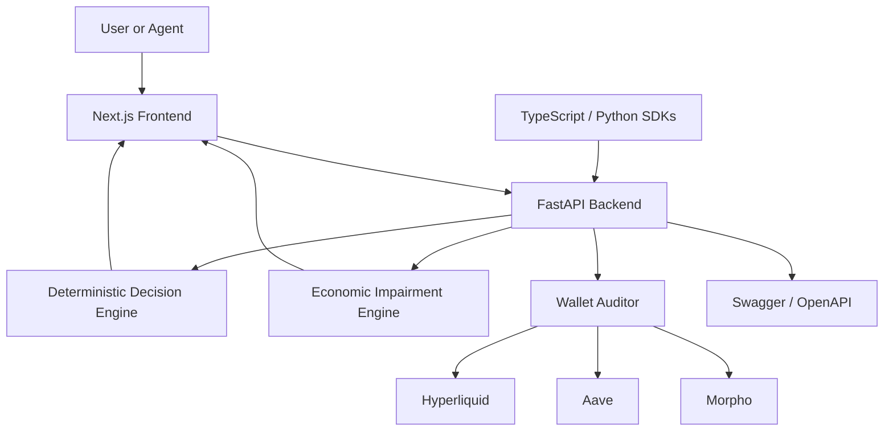

# Δ DeltaZero

<div align="center">

Deterministic risk intelligence for pseudo delta-neutral DeFi strategies and read-only wallet portfolios.

[](https://www.python.org/)
[](https://fastapi.tiangolo.com/)
[](https://nextjs.org/)
[](https://www.typescriptlang.org/)
[](https://tailwindcss.com/)
[](https://www.okx.com/)

[](https://delta-zero-alpha.vercel.app)
[](https://github.com/Teecash96/DeltaZero#readme)
[](#sdk)
[](https://x.com/DeltaZeroASP)

</div>

DeltaZero is an enterprise-style open-source project for deterministic DeFi risk analysis. It helps users and agents evaluate proposed carry strategies, audit existing positions, stress test scenarios, and inspect supported public wallet data without custody, signatures, or trade execution.

The stack is intentionally straightforward: a Next.js App Router frontend, a FastAPI backend, a rule-based decision engine, read-only wallet adapters, and thin SDKs for TypeScript and Python. The product is built for hackathon-grade transparency, not for autonomous execution.

## Why DeltaZero?

DeltaZero solves the problem of turning uncertain pseudo delta-neutral DeFi assumptions into a clear deterministic risk decision.

Differentiators:

1. One decision engine across Builder, Auditor, Stress Test, and Wallet Auditor.
2. Explicit recommendation logic with strategy health, decision confidence, safety buffer, and impairment analysis.
3. Read-only support for supported public wallet data sources without private keys, signatures, or transaction permissions.
4. Local SDKs for agents and dashboards that call the same live API contracts as the web app.

## Current Capabilities

| Capability | What it does |
| --- | --- |
| Builder | Proposes a pseudo delta-neutral structure from capital, market assumptions, risk tolerance, and target style. |
| Auditor | Evaluates an existing long, short, and collateral structure for hedge drift, capital risk, and corrective action. |
| Stress Test | Applies deterministic shocks and returns post-stress metrics, impairment, health, and action. |
| Wallet Auditor | Performs read-only portfolio analysis on supported public wallet and protocol data. |
| Decision Engine | Centralizes carry, hedge, safety buffer, capital risk, and recommendation logic. |
| Economic Impairment | Calculates scenario-based impairment loss, breakdown, and post-impairment equity. |
| SDK | Ships local TypeScript and Python client packages for agents and internal tooling. |
| Hyperliquid | Provides read-only perpetual position and account analysis for supported wallet workflows. |
| Aave | Provides read-only supply, borrow, collateral, and health-factor analysis when RPC access is available. |
| Morpho | Provides read-only market and vault position analysis through Morpho’s public API. |
| Interactive Strategy Preview | Shows an illustrative frontend-only preview of style and market stress. |

## Architecture



### Frontend

The frontend uses the Next.js App Router, React, TypeScript, and Tailwind CSS. It provides:

- `/` — product overview, quick links, integrations, FAQs, and agent SDK examples
- `/builder` — strategy construction workflow
- `/auditor` — existing-position audit workflow
- `/stress-test` — scenario analysis workflow
- `/wallet` — read-only wallet portfolio auditor
- `/demo` — preloaded examples for the core services

The browser talks to the API configured through `NEXT_PUBLIC_API_BASE`, which defaults to `http://localhost:8000`.

### Backend

The backend is a FastAPI application with Pydantic validation, deterministic decision services, impairment calculations, and read-only wallet adapters. It exposes OpenAPI documentation automatically and includes pytest coverage for the strategy workflows, wallet auditor, and impairment engine.

### API

The backend accepts JSON requests and returns deterministic risk reports.

- `POST /strategy/build` — proposes a long, short, and collateral structure plus metrics, health, recommendation, and risk notes.
- `POST /strategy/audit` — evaluates an existing structure and returns health, recommendation, actions, and risk notes.
- `POST /strategy/stress-test` — applies deterministic scenario shocks and returns stressed metrics, impairment, and action.
- `POST /wallet/analyze` — analyzes supported public wallet positions and returns a read-only portfolio report.

### Risk Engine

The risk engine is deterministic and rule-based. It derives carry, hedge ratio, hedge drift, net delta, safety buffer, capital risk, recommendation action, decision confidence, and scenario impairment outcomes from user inputs and supported read-only wallet data.

It does not execute trades, request wallet signatures, or claim live autonomous market intelligence.

## How It Works

1. Input — provide asset, capital, risk tolerance, target style, yield assumptions, funding assumptions, fees, or existing position data.
2. Analyze — DeltaZero calculates carry, hedge ratio, hedge drift, net delta, collateral resilience, capital at risk, safety buffer, and impairment where relevant.
3. Assess — the deterministic engine compares metrics against thresholds based on risk tolerance, target style, service type, and stress scenario.
4. Decide — DeltaZero returns strategy health, recommended action, decision confidence, risk notes, and a recommended structure or corrective actions.
5. Act — the output can be used to `OPEN`, `WAIT`, `HOLD`, `REBALANCE`, `REDUCE`, or `CLOSE`.

## Products

### Strategy Builder

Builds a pseudo delta-neutral structure from capital, market assumptions, risk tolerance, and target style.

Returns:

- recommended long notional
- short notional
- collateral allocation
- target hedge ratio
- carry metrics
- safety buffer
- recommendation action

### Position Auditor

Analyzes an existing long, short, and collateral structure.

Returns:

- current health
- hedge drift
- capital risk
- safety buffer
- corrective action

### Stress Test

Applies deterministic scenario shocks such as funding worsening, yield drops, price changes, and collateral pressure.

Returns:

- post-stress metrics
- post-stress health
- recommendation action
- impairment analysis
- scenario impact

### Wallet Auditor

The Wallet Auditor is a read-only public wallet analysis service.

It accepts a wallet address, selected networks, selected protocols, and a stress profile, then returns a deterministic portfolio report based on supported public data.

Key properties:

- read-only by design
- no seed phrases
- no private keys
- no signatures
- no transaction approvals
- explicit handling for no supported positions, partial data, and insufficient data

Supported sources:

- Hyperliquid public Info API
- Aave read-only RPC patterns
- Morpho public GraphQL API

### Decision Engine

DeltaZero uses one centralized decision context to evaluate carry state, hedge state, safety buffer state, capital risk state, and impairment state. The same evaluated context drives strategy health, recommendation action, recommendation summary, risk notes, and confidence.

### Economic Impairment

The stress test includes scenario-based economic impairment analysis. It estimates:

- impairment loss in USD
- impairment loss as a percentage
- post-impairment equity
- breakdown by asset impact, hedge PnL, collateral haircut, exit slippage, liquidation penalty, and protocol loss assumption

This is scenario analysis, not formal accounting treatment.

## Wallet Auditor

Wallet Auditor is available at `/wallet` and is positioned as a PRO PREVIEW capability.

It is designed for read-only analysis of supported public wallet data. The report clearly distinguishes:

- no supported positions
- partial data
- insufficient data
- positions found

It returns:

- portfolio summary
- risk metrics
- strategy health when meaningful
- recommendation when meaningful
- corrective actions
- detected positions
- protocol warnings
- raw JSON

If supported positions are not found, the service returns a dedicated empty state instead of forcing a portfolio risk recommendation.

## Live Read Only Integrations

### Hyperliquid

Status: LIVE

Read only perpetual positions, margin data, account value, unrealized PnL, and liquidation context through public protocol data.

### Aave

Status: LIVE WITH RPC

Read only supply, borrow, collateral, debt, and health factor analysis when supported RPC access is configured.

### Morpho

Status: LIVE

Read only market and vault position analysis through Morpho’s supported public API.

Live integrations are read only. DeltaZero does not request signatures, private keys, approvals, or transaction permissions.

## Planned Integrations

- Pendle — fixed-yield, PT, YT, and maturity-risk analysis.
- Ethena — synthetic-dollar and hedged-yield strategy analysis.
- Live Funding Rates — real time perpetual funding inputs from supported venues.
- Additional Wallet and Protocol Coverage — more networks, assets, protocols, LP positions, and portfolio adapters.

## SDK

DeltaZero ships local SDK packages for agents and internal automation.

Status:

- Local SDK package
- SDK Preview

The TypeScript and Python SDKs are available directly from this repository for local installation and agent integration. Public registry publication is planned after interface validation.

### TypeScript

Package: `@deltazero/core`

Location: `sdk/typescript`

Supported methods:

- `buildStrategy()`
- `auditPosition()`
- `stressTest()`
- `auditWallet()`

Example:

```ts
import { DeltaZeroClient } from "@deltazero/core";

const client = new DeltaZeroClient({
  baseUrl: "https://deltazero-production.up.railway.app",
});

const report = await client.buildStrategy({
  asset: "SOL",
  capital_usd: 5000,
  risk_tolerance: "medium",
  target_style: "neutral_yield",
  long_yield_apy: 14,
  short_funding_apy: 3,
  fee_drag_apy: 1,
});

console.log(report.recommendation.action);
```

### Python

Package: `deltazero-core`

Location: `sdk/python`

Supported methods:

- `build_strategy()`
- `audit_position()`
- `stress_test()`
- `audit_wallet()`

Example:

```python
from deltazero import DeltaZeroClient

client = DeltaZeroClient(
    base_url="https://deltazero-production.up.railway.app"
)

report = client.build_strategy({
    "asset": "SOL",
    "capital_usd": 5000,
    "risk_tolerance": "medium",
    "target_style": "neutral_yield",
    "long_yield_apy": 14,
    "short_funding_apy": 3,
    "fee_drag_apy": 1,
})

print(report["recommendation"]["action"])
```

### Agent use cases

- portfolio automation with deterministic JSON responses
- dashboards that need a live API client without duplicate business logic
- offline workflows that call the Builder, Auditor, Stress Test, and Wallet Auditor endpoints

## API

### Swagger

Interactive API documentation is available at:

- Local: `http://localhost:8000/docs`
- Production: `https://deltazero-production.up.railway.app/docs`

OpenAPI schema:

- `GET /openapi.json`

### Base URL

The frontend and SDKs use the same API base URL convention:

- `http://localhost:8000` for local development
- `https://deltazero-production.up.railway.app` for production

### Endpoints

| Method | Path | Purpose |
| --- | --- | --- |
| `POST` | `/strategy/build` | Build a pseudo delta-neutral strategy. |
| `POST` | `/strategy/audit` | Audit an existing position. |
| `POST` | `/strategy/stress-test` | Stress test a proposed or existing structure. |
| `POST` | `/wallet/analyze` | Analyze supported public wallet positions. |

## Roadmap

DeltaZero is intentionally narrow today. The near-term roadmap focuses on:

- broader read-only wallet coverage
- additional public protocol adapters
- saved reports and export flows
- continuous alerts for risk thresholds
- public SDK publication after preview validation
- additional agent-facing ergonomics

## Installation

### Prerequisites

- Python 3.11+
- Node.js 20+
- npm

### Backend

```bash
cd backend
python3 -m venv .venv
source .venv/bin/activate
pip install -r requirements.txt
uvicorn app.main:app --reload --host 127.0.0.1 --port 8000
```

If you use the wallet auditor with Aave support, set the configured RPC URLs in your environment:

- `ETHEREUM_RPC_URL`
- `ARBITRUM_RPC_URL`

### Frontend

```bash
cd frontend
npm install
echo "NEXT_PUBLIC_API_BASE=http://localhost:8000" > .env.local
npm run dev
```

### Run both services locally

1. Start the backend on port `8000`.
2. Start the frontend on port `3000`.
3. Open `http://localhost:3000`.

### SDKs from the local repository

TypeScript:

```bash
cd sdk/typescript
npm install
npm test
```

Python:

```bash
cd sdk/python
python3 -m venv .venv
source .venv/bin/activate
pip install -e .
python3 -m unittest discover -s tests -p "test_*.py"
```

## License

DeltaZero is released under the MIT License. See [LICENSE](LICENSE).

## Built by Akanbi Labs

DeltaZero is built by Akanbi Labs.
