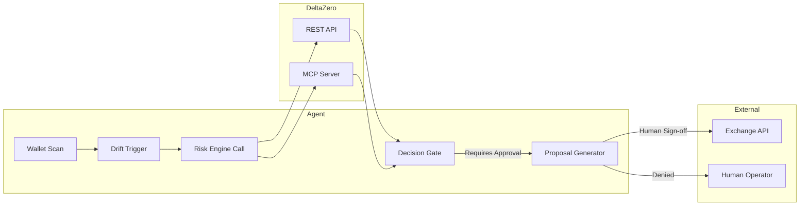

# Building Agents with DeltaZero

This guide shows you how to integrate DeltaZero into your AI agent workflow — from initial scan to structured risk assessment and proposal generation.

## Overview: What Agents Can Do With DeltaZero

Agents can use DeltaZero for:

1. **Pre-trade risk checks** — validate strategy assumptions before deploying capital
2. **Portfolio review workflows** — analyze supported public wallets across protocols
3. **Scenario-risk gates** — Monte Carlo stress tests as compliance checkpoints
4. **Report generation** — deterministic Risk Envelope outputs for audit trails
5. **Structured inputs** — feed validated risk metrics into broader orchestration systems

**Crucial:** DeltaZero never executes trades. It's decision support, not execution authorization.

---

## Quick Start: Three Patterns

### Pattern 1: Deterministic Pre-Trade Check (REST)

```typescript
import { DeltaZeroClient } from "deltazero-core";

const client = new DeltaZeroClient({
  baseUrl: "https://deltazero-production.up.railway.app",
  timeoutMs: 10_000,
});

// Build proposed structure
const report = await client.buildStrategy({
  asset: "SOL",
  capital_usd: 5000,
  risk_tolerance: "medium",
  target_style: "neutral_yield",
  long_yield_apy: 14,
  short_funding_apy: 3,
  fee_drag_apy: 1,
});

// Check decision confidence
if (report.decision_confidence! < 70) {
  console.log("Low clarity → require human approval");
}

// Render recommendation safely
console.log(`Action: ${report.recommendation.action}`);
console.log(`Risk zone: ${report.risk_envelope.decision.risk_zone}`);
console.log(`Summary: ${report.recommendation.summary}`);
```

**Agent usage:** Call this before every capital deployment decision. Block on `REBALANCE` or `REDUCE`.

---

### Pattern 2: Agent-in-a-Box Loop (Example Bot)

See the full executable example: [`examples/agent-bot/agent-bot.mjs`](../examples/agent-bot/agent-bot.mjs)

```javascript
// Pseudocode: autonomous guard loop
async function runAgentLoop() {
  const config = {
    walletAddress: "public-address-or-null",
    riskTolerance: "medium",
    driftThreshold: 6, // percent
    maxCapitalUSD: 5000,
  };

  while (true) {
    // 1. Simulate wallet scan (live or mock)
    const exposure = await simulateWalletScan(config.walletAddress);

    // 2. Check hedge drift threshold
    const driftPct = calculateHedgeDrift(exposure);
    if (driftPct > config.driftThreshold) {
      console.log(`Drift breach: ${driftPct.toFixed(2)}%`);

      // 3. Call live audit API
      const audit = await deltaZero.auditPosition({
        long_notional_usd: exposure.longNotional,
        short_notional_usd: exposure.shortNotional,
        collateral_usd: exposure.collateral,
        asset: exposure.asset,
        capital_usd: exposure.capital,
        risk_tolerance: config.riskTolerance,
        target_style: "neutral_yield",
        long_yield_apy: 14,
        short_funding_apy: 3,
        fee_drag_apy: 1,
      });

      // 4. Generate proposal-only rebalance payload
      const proposal = generateRebalancePayload(audit, exposure);
      
      // 5. Require explicit human approval before any action
      if (await requestHumanApproval(proposal)) {
        // Only now do you proceed — and DeltaZero never touches that step
        await submitRebalanceToExchange(proposal);
      } else {
        console.log("Human denied approval → no action taken");
      }

      break; // single-run mode; remove for persistent loop
    }

    await delay(60_000); // check once per minute
  }
}
```

**Key safety rails:**

- **Execution Authority** is off by default — the loop stops at proposal generation
- **Simulation mode** means no real wallet access until explicitly enabled
- **Human approval** required before any exchange API call

---

### Pattern 3: A2MCP Integration (OKX.AI Native)

For agents registered on OKX.AI, use the MCP server for seamless tool calls.

**Tool list discovery:**

```bash
curl -i -X POST https://deltazero-production.up.railway.app/mcp \
  -H "Content-Type: application/json" \
  -d '{"jsonrpc":"2.0","id":1,"method":"tools/list","params":{}}'
```

Returns all available tools including:

- `build_neutral_strategy`
- `audit_hedge_drift`
- `run_funding_stress`
- `run_monte_carlo`
- `run_complete_risk_engine`
- `evaluate_risk_envelope`
- `explain_risk_recommendation`

**Calling a tool:**

```bash
curl -i -X POST https://deltazero-production.up.railway.app/mcp/call \
  -H "Content-Type: application/json" \
  -d '{
    "tool": "run_complete_risk_engine",
    "arguments": {
      "asset": "SOL",
      "capital_usd": 5000,
      "risk_tolerance": "medium",
      "target_style": "neutral_yield",
      "long_yield_apy": 14,
      "short_funding_apy": 3,
      "fee_drag_apy": 1,
      "simulation_count": 1000,
      "seed": 42
    }
  }'
```

**Payment flow (A2MCP x402):**

1. Agent calls `/mcp/call` without payment → gets HTTP 402
2. Agent receives base64-encoded `PAYMENT-REQUIRED` header
3. Agent signs EIP-3009 transfer (1 USDT on X Layer)
4. Agent replays request with `X-PAYMENT` signature
5. Backend verifies on-chain → returns full analysis

**OKX.AI integration example:**

```typescript
import { OkxA2AClient } from "@okxweb3/onchainos-sdk";

const client = new OkxA2AClient();

// Create task
const jobId = await client.createTask({
  title: "DeFi Risk Analysis",
  description: "Run complete risk engine pass for SOL position",
  budget: 1,
  currency: "USDT",
  provider: "5739", // DeltaZero ASP ID
  endpoint: "https://deltazero-production.up.railway.app/mcp/call",
});

// Wait for delivery
const deliverable = await client.pollJob(jobId);
const riskEnvelope = JSON.parse(deliverable.txt);

console.log(`Recommendation: ${riskEnvelope.evidence.funding_stress_action}`);
console.log(`Safety Buffer: ${riskEnvelope.measures.safety_buffer_score}`);
```

---

## Execution Authority Pattern

**Never** give agents implicit permission to execute trades. Here's the pattern:

```rust
// Rust pseudocode: explicit gating architecture
struct AgentExecutor {
    delta_client: DeltaZeroClient,
    exchange_api: ExchangeAPI,
    requires_human_approval: bool, // always true
}

impl AgentExecutor {
    async fn run_guard_loop(&self) -> Result<()> {
        let risk_report = self.delta_client.run_complete_risk_engine(...).await?;
        
        match risk_report.recommendation.action {
            Action::REBALANCE | Action::REDUCE => {
                // Stop here — generate proposal only
                let proposal = Proposal {
                    action: risk_report.recommendation.action,
                    summary: risk_report.recommendation.summary,
                    risk_zone: risk_report.risk_envelope.decision.risk_zone,
                    delta_zero_evidence: risk_report, // include full report
                };
                
                // Send to human for approval
                if self.requires_human_approval && !self.request_approval(&proposal).await {
                    return Ok(()); // human denied → stop
                }
                
                // Now it's safe to proceed — but DeltaZero never does this
                self.exchange_api.execute_rebalance(proposal).await?;
            },
            _ => {}, // HOLD or WAIT — no action
        }
        
        Ok(())
    }
}
```

**Takeaway:** DeltaZero provides the *what* and *why*. Your agent decides the *when* and *whether* — with human oversight.

---

## Error Handling for Agents

DeltaZero uses deterministic error codes:

| Status | Meaning | Agent Response |
|--------|---------|----------------|
| `no_supported_positions` | Wallet address has no compatible positions | Log warning → skip risk check |
| `partial_data` | Some protocols returned data, others failed | Reduce confidence → add warnings |
| `insufficient_data` | All sources failed | Block deployment → wait for retry |

Example:

```typescript
const result = await client.auditWallet(walletRequest);

switch (result.status) {
  case "no_supported_positions":
    console.warn("No positions found on supported networks");
    return;
  case "partial_data":
    console.warn(`Warning: ${result.warnings.join(", ")}`);
    // Proceed with reduced confidence
    break;
  case "insufficient_data":
    console.error("Data collection failed");
    // Block deployment
    throw new Error("Insufficient data for risk assessment");
  default:
    // Full assessment available
}
```

---

## Benchmark Data for Trust Claims

When evaluating agents, include these numbers:

From [`backend/benchmarks/agent_risk_benchmark.py`](../backend/benchmarks/agent_risk_benchmark.py):

| Evidence | Result |
| --- | ---: |
| Median local decision latency | 18.09 ms |
| P95 local decision latency | 19.48 ms |
| Identical normalized outputs | 50 / 50 |
| Schema-valid responses | 50 / 50 |
| Reference-policy fixture agreement | 12 / 12 |

These prove repeatability and correctness — critical for agent trust.

---

## Recommended Agent Workflow Architecture



**Rules:**

1. **Scan → trigger → call**: Never bypass the risk check
2. **Decision gate**: Block on non-HOLD actions
3. **Human approval**: Always required before exchange APIs
4. **DeltaZero stays out of execution**: It recommends, never acts

---

## Security Checklist for Agent Builders

- [ ] Set `requires_human_approval = true` in your executor class
- [ ] Store `DELTAZERO_ADMIN_KEY` in environment variables only — never in code
- [ ] Validate all API responses against the published SDK schemas
- [ ] Log admin-bypass usage separately from production logs
- [ ] Test with seed addresses first (`testnet` if available)
- [ ] Include `timeoutMs` in client initialization (recommended: 10 seconds)
- [ ] Handle `partial_data` gracefully — don't treat warnings as success
- [ ] Monitor `decision_confidence` scores — alert when consistently low

---

## Resources

- **Full example bot:** [`examples/agent-bot/agent-bot.mjs`](../examples/agent-bot/agent-bot.mjs)
- **TypeScript SDK:** [`sdk/typescript/`](../sdk/typescript/)
- **Python SDK:** [`sdk/python/`](../sdk/python/)
- **OpenAPI spec:** [Production Swagger UI](https://deltazero-production.up.railway.app/docs)
- **MCP tool list:** Streamable HTTP `/mcp` endpoint
- **Benchmark source:** [`backend/benchmarks/agent_risk_benchmark.py`](../backend/benchmarks/agent_risk_benchmark.py)

---

## Final Principle: Agents Recommend, Humans Execute

Every agent built on DeltaZero should embody:

> **Detect → Analyze → Propose → Approve**

Where "Approve" is either a human click or a pre-configured policy gate — never implicit authority. That boundary makes DeltaZero valuable: you get deterministic risk intelligence without giving up control.
